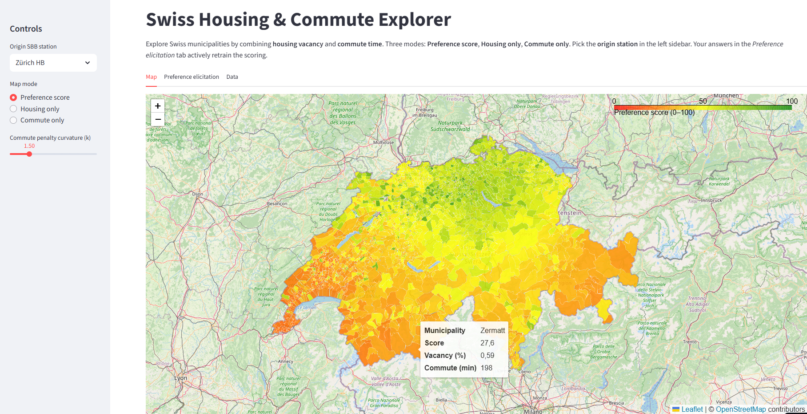

# 🏠🚆 Swiss Housing & Commute Explorer

[](LICENSE)

[](https://github.com/ingo-stallknecht/swiss-commute-housing/actions/workflows/tests.yml)
[](https://github.com/ingo-stallknecht/swiss-commute-housing/actions/workflows/ci.yml)
[](https://YOUR-STREAMLIT-APP-LINK)


Interactive **Streamlit app** to explore the trade-off between **housing availability** and **public transport accessibility** across Swiss municipalities.

- **Data**: housing vacancy shares + GTFS rail timetables  
- **Geospatial**: municipality polygons, centroid heuristics, LV95/CH ↔ WGS84  
- **Artifacts**: reproducible builder exports GeoJSON/Parquet/CSV for the app  
- **App**: interactive map + controls for housing/commute weights and penalty curvature  

---

## 🚀 Live Demo

👉 **Streamlit App:** [Live link here](https://YOUR-STREAMLIT-APP-LINK)  
👉 **Colab Notebook:** [Notebook link here](https://colab.research.google.com/github/ingo-stallknecht/swiss-commute-housing/blob/main/notebooks/colab_main.ipynb)

📸 *Screenshot of the app interface:*  


---

## 🧩 Problem Statement

Housing decisions balance **availability** and **accessibility**.  
This tool helps answer:

> “Which Swiss municipalities combine **higher housing vacancy** with **shorter commute times** from my chosen SBB station?”

---

## 📊 Data Science Approach

- **Inputs**
  - BFS housing vacancy (municipality level)
  - GTFS Swiss rail timetables
  - Gemeinde polygons (OpenDataSoft)

- **Processing**
  - Parse BFS-like CSV headers robustly  
  - Build GTFS station graph and compute travel times (multi-origin)  
  - Join vacancy rates + average travel minutes  

- **Scoring**
  - Normalize vacancy & commute into [0,1]  
  - Apply exponential commute penalty  
  - Logistic squashing → preference score (0–100)  

- **Artifacts**
  - `gemeinden.geojson`, `gemeinden.csv`  
  - `gemeinden_centroids.parquet`  
  - `meta.json` (scoring params)  
  - `tt_by_origin.parquet` (multi-origin travel times)  

---

## ✨ Key Features

- **Interactive dashboard**:
  - Switch between *preference score*, *housing only*, *commute only*  
  - Choose different SBB origins dynamically  

📸 *Example views (insert before publishing):*  
- Housing only heatmap → `assets/map_housing_only.png`  
- Commute only heatmap → `assets/map_commute_only.png`  
- Preference score combined → `assets/screenshot_app.png`

---

## 🛠️ How to Run Locally

Clone, install, build artifacts, and run the app:

```bash
git clone https://github.com/ingo-stallknecht/swiss-commute-housing.git
cd swiss-commute-housing

# Create and activate virtualenv
python -m venv .venv
source .venv/Scripts/activate   # Windows (Git Bash)
# source .venv/bin/activate     # macOS/Linux

pip install -r requirements.txt
.venv/Scripts/python -m pip install -e .

# Place input data in data/
#   data/vacancy_municipality.csv
#   data/gtfs_train.zip

# Build artifacts
.venv/Scripts/python scripts/make_artifacts.py

# Run the app
.venv/Scripts/python scripts/launch_app.py
