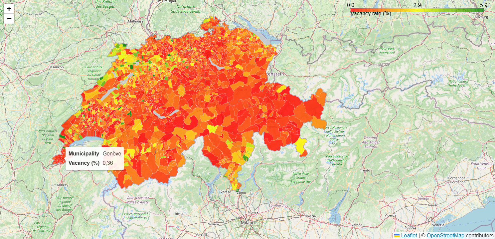
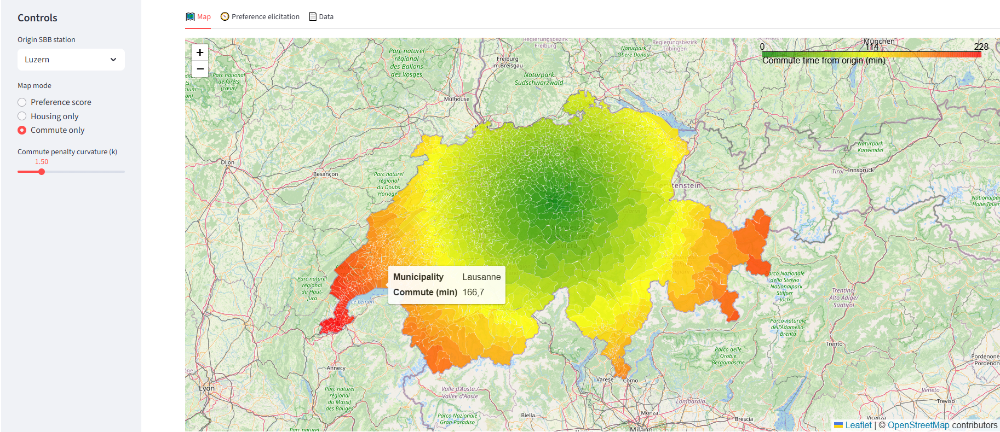

# Swiss Housing & Commute Explorer

[](LICENSE)

[](https://github.com/ingo-stallknecht/swiss-commute-housing/actions/workflows/tests.yml)
[](https://github.com/ingo-stallknecht/swiss-commute-housing/actions/workflows/ci.yml)
[](https://swiss-commute-housing-ivg9a6hhq3j5gkaq9yintl.streamlit.app/)


Interactive **Streamlit app** to explore the trade-off between **housing availability** and **public transport accessibility** across Swiss municipalities.

- **Housing vacancy**: BFS *Leerwohnungszählung* (official annual survey of vacant dwellings)
- **Public transport**: GTFS schedules from SBB (trains, trams, buses, ferries — full Swiss feed, not just trains)
- **Geospatial**: municipality polygons, centroid heuristics, LV95/CH ↔ WGS84
- **Artifacts**: reproducible builder exports GeoJSON/Parquet/CSV for the app
- **App**: interactive map + preference elicitation based on user choices

---

## Live Demo

**Streamlit App:** [Try it here](https://swiss-commute-housing-ivg9a6hhq3j5gkaq9yintl.streamlit.app/)

**Colab Notebook:** [Explore on Colab](https://colab.research.google.com/github/ingo-stallknecht/swiss-commute-housing/blob/main/notebooks/swiss_commute_housing.ipynb)

*Screenshot of the app interface:*


---

## Problem Statement

Housing decisions balance **availability** and **accessibility**.
This tool helps answer:

> “Which Swiss municipalities combine **higher housing vacancy** with **shorter commute times** from my chosen SBB station?”

---

## Technical Approach

This project demonstrates a full **data → geospatial → scoring → deployment** pipeline:

### 1. Data Sources
- **Housing vacancy**: BFS *Leerwohnungszählung* (municipality-level vacancy shares).
  - BFS exports arrive as multi-header CSVs → parsed with a robust header detector.
- **Public transport (GTFS)**: Official nationwide GTFS feed from SBB.
  - Includes trains, trams, buses, ferries — not just trains.
  - Tables: `stops.txt`, `trips.txt`, `routes.txt`, `stop_times.txt`.
- **Geospatial**: Municipality boundaries (Opendatasoft).
  - CRS conversions: LV95 (EPSG:2056) ↔ WGS84 (EPSG:4326).
  - Simplified polygons for efficient rendering.

### 2. Commute Time Computation
- Build a **stop graph** from GTFS feed.
- Compute **shortest-path travel minutes** from a chosen origin stop.
- Aggregate travel times to municipalities by centroid mapping.

### 3. Preference Scoring
- Normalize vacancy (%) and commute time into [0,1].
- Apply an **exponential penalty** for long commutes.
- Combine housing + commute into a **logistic utility** → 0–100 preference score.
- **Preference elicitation**: interactive A/B questions adjust weights dynamically.

### 4. Reproducible Artifacts
The pipeline (`scripts/make_artifacts.py`) exports:
- `gemeinden_simplified.geojson` (lightweight polygons)
- `meta.json` (default scoring parameters)
- `tt_by_origin.parquet` / `.csv` (multi-origin commute times)

### 5. Deployment
- **Streamlit UI** (`app/app.py`) with Folium maps and interactive controls.
- **Dockerized** app (for portability & reproducibility).
- **GitHub CI** ensures formatting, linting, and smoke-build of artifacts.
- Hosted on **Streamlit Cloud** with automatic redeploys on push.

---

## Key Features

- **Interactive map dashboard**:
  - Switch views: *preference score*, *housing vacancy only*, *commute time only*
  - Adjust **commute penalty curvature** and **origin SBB station**
  - Elicit preferences by answering A/B trade-off questions

*Example views:*
- Housing only heatmap → 
- Commute only heatmap → 

---

## How to Run Locally

Clone, install, add data, build artifacts, run the app:

```bash
git clone https://github.com/ingo-stallknecht/swiss-commute-housing.git
cd swiss-commute-housing

# Create and activate virtualenv
python -m venv .venv
# Windows (Git Bash):
source .venv/Scripts/activate
# macOS/Linux:
# source .venv/bin/activate

# Install deps and the package (editable)
pip install -r requirements.txt
pip install -e .

# --- Place input data in the repo's data/ folder ---
# Required:
#   data/vacancy_municipality.csv
#   data/gtfs_train.zip

# Build artifacts (you can change the default origin if you like)
python scripts/make_artifacts.py --default-origin "Zürich HB"

# Run the app
streamlit run app/app.py
